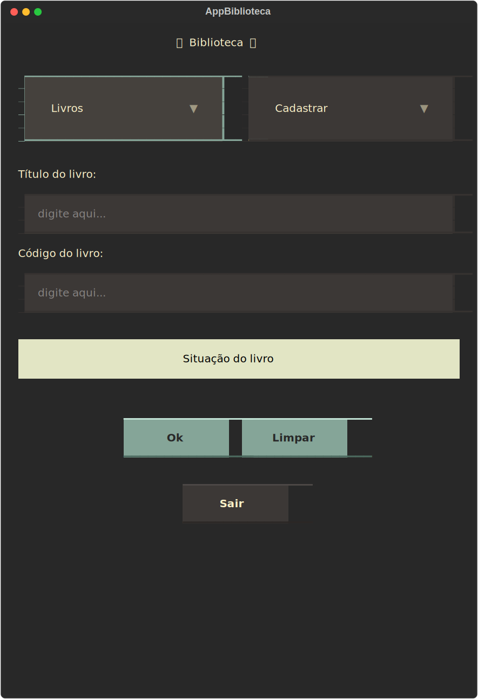
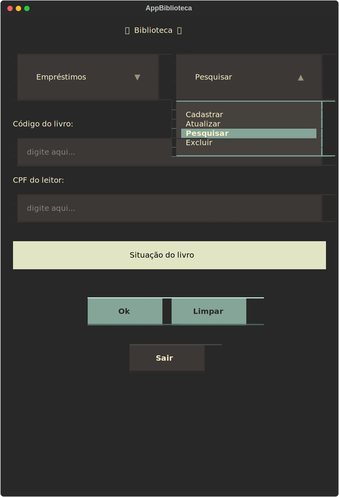
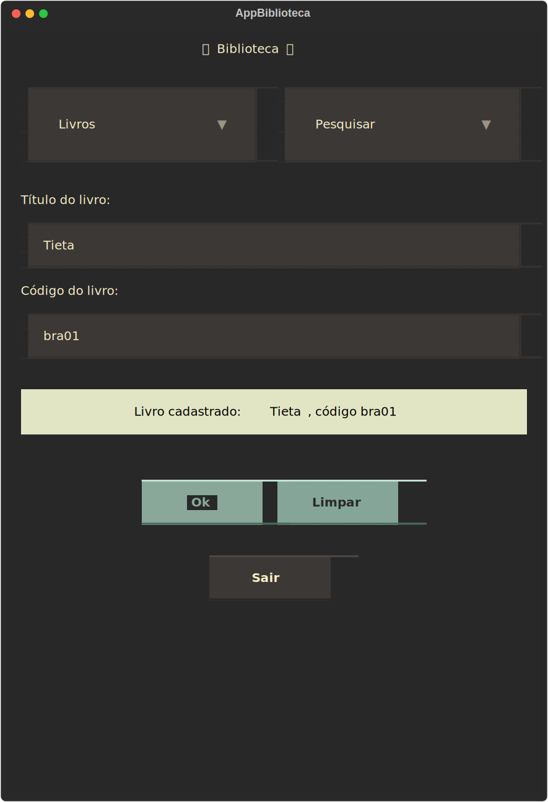

# Projeto de bibioteca com tela única

Neste projeto, remodelei a view do [projeto de biblioteca](https://github.com/leosturmer/proj_biblioteca_novo).

Nesta nova versão, utilizei os widgets Select do framework Textual para fazer o programa funcionar em tela única.

